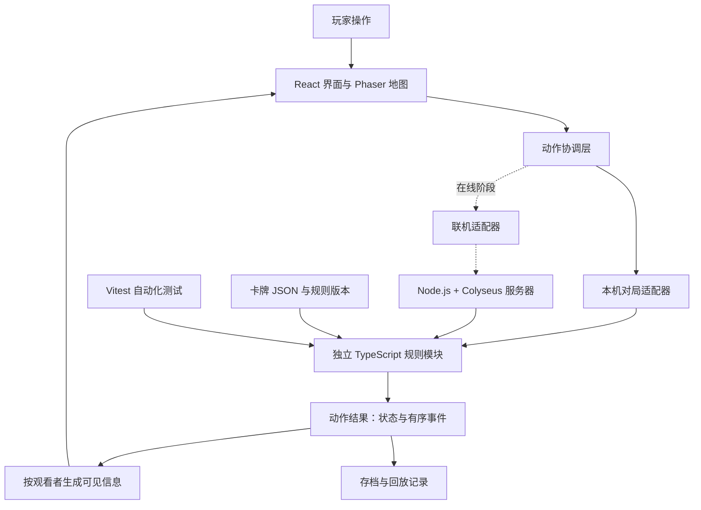

# 明日方舟—再连接：技术架构与研发实施 PRD

**版本：v1.0 · 管理层评审版**  
**日期：2026-10-02**  
**面向读者：项目负责人、管理层、产品与研发团队**  
**关联文档：[游戏规则与交互 PRD](./明日方舟再连接_PRD.md)**

## 1. 项目方案概览

本项目是一款双人对抗的明日方舟同人卡牌战棋游戏。双方使用 30 张牌组，在 9×9 地图中部署、移动、战斗与使用指令，通过三次有效抵达敌方目标点获胜。

本次交流已采纳的技术路线为 **TypeScript + React + Phaser + Vite**。首先交付浏览器可试玩版本；规则与体验达到验收标准后，再推进 Windows 客户端。在线对战作为后续独立阶段，采用 Node.js + Colyseus，由服务器裁定游戏结果。

这条路线的主要价值是：尽早让策划和测试人员实际试玩；通过数据修改卡牌；复用规则代码支持网页、桌面与未来联机；使用自动化测试控制复杂规则的回归风险。这些是项目选型判断，不代表已经测得具体成本节省比例。

| 管理层关注项 | 本方案回答 |
|---|---|
| 第一阶段交付什么 | 可完成完整对局的浏览器试玩版，支持本机双人轮流操作、隐藏手牌、组牌与胜负结算 |
| 为什么适合本项目 | 地图为二维方格，界面包含较多卡牌文本与面板，研发重点是规则正确性和交互迭代 |
| 如何避免平台扩展时重复开发 | 规则模块独立，网页、Windows 客户端与联机服务器调用同一套规则 |
| 如何增加卡牌 | 使用经校验的 JSON 数据；已有机制可通过数据增加内容，新机制由研发扩展规则模块 |
| 如何评价阶段完成 | 按明确里程碑、规则验收用例、完整对局记录、性能与兼容性报告验收 |
| 当前进度 | 已实现 v0.2 浏览器雏形与本机双人操作，并完成参考 KARDS 的实体牌桌界面改版；规则测试及浏览器验收记录见 [雏形验收记录](./docs/雏形验收记录.md)；尚未完成正式卡池平衡、桌面安装包或联机验证 |
| 排期与预算 | 本文提出工作包、职责与成本构成；具体工期和金额根据人员、美术与卡池范围另行核定 |

## 2. 文档边界与项目目标

### 2.1 与游戏规则文档的关系

游戏玩法、数值、坐标、部署区、界面顺序及状态解释，以关联的游戏规则 PRD 和作者后续修订为依据。本文件规定技术实现与交付方式，不重新修改游戏规则。

原规则 PRD 中标为“补全”或“辨读补全”的内容，仍属于设计提案。接受本技术路线，不等于把所有补全玩法都视为作者已确认；开发应使用编号明确的规则版本，并保留后续调整能力。

本文件中的性能目标、岗位配置、存档方式和联机交付要求是研发方案建议，需要在对应阶段落实；不能把写入文档视为已经通过测试。

### 2.2 项目目标

| 目标 | 可验证结果 |
|---|---|
| 游戏可以真正玩完 | 从合法牌组开局，到三次抵达或回合上限，完整执行结算 |
| 规则结果可靠 | 部署、移动、伤害、反击、技能、元素及卡牌流转均可测试和复现 |
| 内容便于迭代 | 修改已有机制的卡牌属性、范围和效果参数，经过校验后可直接用于试玩 |
| 产品表现可持续优化 | 替换立绘、调整卡面、修改动画不会改变规则结算结果 |
| 平台可以逐步扩展 | Windows 包装与联机扩展沿用已有规则模块和主要界面 |

### 2.3 首版范围

首版必须包括：主菜单、牌组准备、对局、结果、规则与设置页面；指定的地图和上下牌区布局；本机双人交接；完整回合、战斗、技能、指令、状态与元素；本地存档与对局复现资料。

首版以桌面浏览器和鼠标操作为基准。正式卡池与美术未齐备时，可使用明确标注的测试数据验证规则，但正式内容验收需要作者提供真实卡牌数据及素材。

Windows 安装包、在线房间、断线重连分别设立后续交付阶段。手机完整适配、AI、观战、排行榜、付费系统与大型内容编辑器尚未纳入本次首版范围。

## 3. 技术选型与职责

### 3.1 已采纳的基础技术栈

| 技术 | 项目职责 | 选择理由 |
|---|---|---|
| TypeScript | 独立规则模块、动作协议、数据结构 | 明确区分卡牌实例、场上单位、状态和事件，便于共用与检查 |
| React + CSS | 菜单、组牌、手牌、计数板、信息框、结果与设置 | 将文本和交互面板拆成可维护组件；长卡文可按既有 PRD 在固定框内滚动 |
| Phaser | 9×9 地图、单位立绘、朝向、范围高亮、地图输入及特效 | 用二维游戏框架承载战场表现与动画 |
| Vite | 开发预览与网页构建 | 快速预览变化，输出可部署的静态网页资源 |
| Vitest | 规则与数据的自动化验证 | 在改规则、加卡牌、修复错误后执行回归检查 |
| JSON | 卡牌、技能、范围及效果参数 | 让已支持的玩法机制可以通过内容数据扩展 |

React 支持以组件构建界面；Phaser 面向浏览器二维游戏，支持 JavaScript/TypeScript、WebGL/Canvas、输入和动画；Vite 提供开发服务器和生产构建。以上框架能力来自官方文档，具体职责分配是本项目的架构决定。[React 官方文档](https://react.dev/)、[Phaser 官方说明](https://phaser.io/why-phaser)、[Vite 官方文档](https://vite.dev/guide/)

Vitest 用于实现本项目的规则测试计划；它不会自动生成完整游戏测试，需要研发逐项编写并映射验收用例。[Vitest 官方文档](https://vitest.dev/guide/)

### 3.2 后续扩展技术

| 阶段 | 技术 | 项目职责 |
|---|---|---|
| Windows 客户端 | Tauri | 复用网页前端，增加安装包、窗口、文件存档及系统集成 |
| 在线对战 | Node.js + Colyseus | 房间、连接管理、服务端动作裁定、面向不同玩家的数据发送 |

Tauri 可以集成 HTML、JavaScript、CSS 前端；Windows 构建需要 Rust 工具链与 C++ 构建工具，界面运行依赖 WebView2。玩家安装客户端不需要安装开发工具链；桌面阶段须验证运行时前置条件与分发体验。[Tauri 官方介绍](https://tauri.app/start/)、[Windows 开发前置条件](https://tauri.app/start/prerequisites/)

Colyseus 提供 Node.js 多人游戏开发框架。项目仍需自行定义规则协议、隐藏信息投影和重连策略，不能假设接入框架后这些业务问题自动解决。[Colyseus 官方文档](https://docs.colyseus.io/)

### 3.3 依赖管理原则

开工时选择相互兼容的稳定版本，记录版本号与锁文件；同一版本的构建环境可复现。开发期间不自动追随每个框架大版本更新，升级需验证现有对局与测试。

首版一个仓库组织客户端、共享规则、内容和测试；在线阶段加入服务器工作区。数据库、缓存集群和复杂账号系统按实际产品需求引入，首版本机对局无需部署对战服务器。

## 4. 总体架构

### 4.1 架构图



本机与联机是两种运行模式：本机由本地规则模块裁定；联机由服务器规则模块裁定。联机时，完整状态留在服务器，只将对应玩家可见的数据送到客户端；图中的“可见信息”步骤须在服务器完成后再发送。

### 4.2 核心分工

| 模块 | 负责 | 输入与输出 |
|---|---|---|
| 界面层 | 文本、卡牌、菜单、面板、交接遮罩 | 接收可见数据，产生操作意图 |
| 地图层 | 立绘、格子、范围、朝向、动画、地图选择 | 接收可见数据及事件，产生地图操作意图 |
| 动作协调层 | 统一输入、预览、确认、响应与界面同步 | 将操作转成标准动作，展示规则返回结果 |
| 对局适配层 | 连接本机或联机裁定方 | 使用统一动作协议，避免界面依赖运行模式 |
| 规则模块 | 合法性、资源、次数、战斗、状态、卡牌区域、胜负 | 由状态和动作生成新的状态、事件或错误原因 |
| 内容模块 | 卡牌、技能、图形范围、效果定义与校验 | 给规则模块提供经验证的版本化内容 |
| 存档与回放模块 | 状态快照、操作历史、版本与随机信息 | 保存与重建对局 |

### 4.3 规则与表现的边界

**规则模块是游戏结果的唯一裁定者。**React 和 Phaser 负责操作与显示，不直接修改指挥点、生命、牌堆或得分。

例如，干员移动到敌方目标点时，规则模块完整计算：移动是否合法、费用、是否被神经状态无效化、是否自动交战、防守者是否存活、是否得分、是否永久移除以及是否结束。界面再根据有序事件播放移动、伤害和得分动画。

动画播放速度、跳过动画、窗口帧率和素材加载顺序都不得改变这次结算结果。动画处理期间避免重复提交同一个动作；允许玩家跳过长动画查看已裁定的结果。

规则模块不依赖 React、Phaser、浏览器 DOM 或 Tauri；随机结果来自传入的受控随机状态，规则计时使用回合编号。这样可以在测试和 Node.js 服务器中运行同一套代码。

### 4.4 React 与 Phaser 的协作

React 维护菜单、选中对象、详情框等界面状态；Phaser 维护场景、动画进度、视觉对象和命中区域。两者共享规则裁定后的只读视图，不能各自保存一份可修改的对局真相。

地图画布位于中央，React 牌区与面板按规则 PRD 布置在上下及两侧。坐标转换、缩放和鼠标命中由地图适配器统一处理；覆盖在画布上的面板必须明确拦截事件，防止一次点击同时操作卡牌与地图。

## 5. 动作与结算需求

### 5.1 标准动作

游戏输入统一为结构化动作：部署、移动/转向、攻击、治疗、开启/关闭技能、使用指令、反制/放弃响应、撤退、超限弃牌、结束回合。

每个动作带上动作编号、行动玩家、对应单位或卡实例、目标、朝向以及当前状态版本。界面不通过修改 JSON 状态来“直接部署”或“直接加分”。

### 5.2 处理步骤

1. 玩家选择操作，显示当前规则下的合法范围、费用及可见结果预测。
2. 玩家确认后，裁定方检查阶段、玩家身份、动作版本、目标和支付条件。
3. 合法动作按规则支付并记录额度，处理必要响应，完成结算并返回有序事件。
4. 非法动作返回明确原因，余额、位置、牌区、状态与行动次数均不变化。
5. 客户端用返回结果刷新信息并播放动画；不得按自己的预测覆盖正式裁定。

合法提交后遭反制、目标失效或神经损伤无效化，按游戏规则规定的付费与次数口径处理；这类结果与“提交前不合法”区分。

### 5.3 规则模块必须保障的事项

| 事项 | 实现要求 |
|---|---|
| 部署与撤退 | 部署每回合最多两次；撤退不限次数，分别计数 |
| 卡费与余额 | 被击败/使用指令 +15、撤退 +5 是对应卡费递增，不能变成余额恢复 |
| 反击 | 一次主动攻击最多触发一次反击；反击不能生成下一次反击 |
| 自动交战 | 保持伤害快照和队列顺序；双方存活时停止本次循环并等待下回合 |
| 抵达 | 按规则检查防守后得分，永久移除，不能进入牌库循环 |
| 数据守恒 | 每个卡实例只在一个区域；一个离场事件只结算一次 |
| 时间 | 全局回合、己方回合与到期时点明确记录 |
| 版本 | 预览、裁定、存档与测试使用相同规则及内容版本 |

### 5.4 预览的限制

预览调用与正式结算相同的规则逻辑，但不修改真实状态、不消耗随机状态。预览只能依据观看者已经知道的信息；有隐藏手牌、未确定抽牌或反制时，显示“不确定”或可能变化的原因，不能为了给出精确预测而读取对手隐藏信息。

## 6. 内容、数据与存档

### 6.1 卡牌数据

区分“卡牌定义”和“卡牌实例”：定义记录名称、属性、范围和效果；实例记录本局身份、拥有者、当前区域与当前卡费。两张同名指令共享定义，费用递增独立计算。

JSON 可表达：属性数值、范围坐标、技能回转、持续时间、弹药、指令等级、目标条件及有序效果。支持的效果类型应形成可检查清单，内容不得通过任意脚本直接修改对局状态。

### 6.2 内容校验与发布

加载时必须验证字段、范围边界、引用关系、费用、数量限制、计时单位与效果顺序。TypeScript 类型检查不能替代对外部 JSON 的运行时校验。

属性调整和已有机制组合可修改数据完成；新增机制，例如新的反制事件或伤害处理方式，需要扩展规则与测试，不能承诺所有卡牌都能完全免代码制作。

对局开始后锁定本局规则和内容版本；修改 JSON 不改变已开始对局。正式内容与测试数据分目录管理，卡池、技能与美术完成度在交付报告中分别列出。

### 6.3 存档

浏览器版通过本地持久化适配器保存数据，建议使用 IndexedDB；Windows 版通过 Tauri 文件接口保存。两种方式共用存档格式与版本检查，存储方式是本版工程建议。

存档包括规则版本、内容版本、对局快照、阶段、随机状态和已提交动作。首版自动保存到稳定回合边界；载入后重新执行必要的交接遮罩，不能直接显示上个玩家的隐藏手牌。

提供导出与导入入口；载入损坏或版本不兼容时保留原文件并说明原因，不自动覆盖。浏览器本地数据可能被清理，因此需要导出能力，不能承诺本地缓存永久保存。

### 6.4 回放与问题复现

记录初始牌组、种子或必要随机结果、规则与内容版本、动作序列、检查点。相同输入和版本应复现相同结果；仅保存随机种子而缺少相同内容、随机实现或操作顺序，不构成可复现回放。

首版提供研发复现记录和公开对局日志，不把完整观战播放器作为首版必交功能。开发完整记录、本机存档、公开日志和未来联机消息使用不同可见性规则。

## 7. 信息可见性与操作体验

### 7.1 隐藏信息

我方手牌显示正面，敌方手牌仅显示背面与数量；抽牌堆只显示数量，不公开内部顺序。弃牌堆与场上单位按规则文档公开。

所有详情、费用提示、搜索、动画和公开日志都应使用观看者视图，不能绕过可见性限制访问完整状态。本机轮流模式以交接遮罩保护正常操作中的手牌；因为完整数据在同一设备，本模式不承诺防止使用开发工具检查数据。

### 7.2 界面验收基线

中央 9×9 地图、两方目标与部署区，严格沿用游戏规则 PRD。地图左侧保留朝上和朝下的正三角回合灯。

上方顺序：敌方当前/上限、抽牌堆、背面手牌、弃牌堆。下方顺序：我方当前/上限、弃牌堆、正面手牌、抽牌堆。

多名干员同格时全部可选择；信息框固定尺寸，内容可滚动。费用、状态、技能回转和永久移除说明在操作前可见。非法操作提供具体原因，预览与取消不产生资源变化。

## 8. 平台交付与扩展

### 8.1 浏览器试玩版

交付可通过网址访问的静态网页版本，另提供构建产物和启动说明。目标支持桌面 Chrome 与 Edge，基准分辨率 1280×720 和 1920×1080；具体浏览器版本、硬件和 WebGL 条件在测试报告中记录。

先进行内部试玩。Web 资源部署位置由项目选择，本文不指定云厂商或购买服务。离线运行不是网页链接天然具备的能力，若需要离线资源缓存，须单独实现并验证。

### 8.2 Windows 客户端阶段

使用 Tauri 接入已验证的网页客户端，规则与主要界面继续复用；Rust 主要用于桌面系统接口，不重写游戏规则。

该阶段交付安装包、版本号、安装说明和卸载验证；验证 WebView2 前置条件、窗口缩放、素材路径、文件存档、音频和鼠标输入。安装包离线运行需要将必要素材包含在包内，并完成断网启动与完整对局测试。

网页试玩通过不等于 Windows 验收通过，桌面阶段单独记录结果。跨平台和商店发行需另行评估。

### 8.3 在线对战阶段

客户端发送操作意图，服务器使用同一 TypeScript 规则模块验证身份、回合、资源、目标和次数后裁定。双方客户端不提交“我造成了多少伤害”或“我已经得分”的最终结果。

服务器保存完整状态、私有手牌和随机信息；分别生成玩家视图后发送。不得把全部状态广播给客户端，再只靠界面隐藏手牌。框架的同步功能需要按本项目的可见性要求配置和验证。

基础交付包括：创建/加入双人房间、牌组提交与验证、准备、开局、动作与反制、结果、连接状态和重连。服务器必须拒绝重复动作、过期版本、越权操作和已经结束后的动作。

重连宽限时间、主动离开、超时和对手掉线如何影响胜负属于联机产品规则，须在此阶段单独确定。不能直接用技术断线替代原本的胜负规则。账号、持久化数据库、匹配和排名按进一步范围增加。

## 9. 质量与验收

### 9.1 规则验收

游戏规则 PRD 已包含 **61 条验收用例**：资源与牌堆 12 条、地图与交战 16 条、战斗技能元素 21 条、得分界面及信息保护 12 条。

建立用例追踪表，将可自动化的规则用例落实到 Vitest，将界面、交接和视觉用例落实到操作测试；每条都有通过/失败记录与证据。不能把 61 条文档用例数量当作已经完成的测试数量。

重点增加组合与长局验证：重复洗牌仍保留卡费；反击不递归；对峙不使程序卡死；弹药耗尽后不会恢复额外普通攻击；永久移除卡不会再次抽到；保存恢复后的状态与随机顺序一致。

### 9.2 性能与稳定性目标

以下是待实现后测量的首版目标，参考机器在 P0 阶段确定，不能作为当前性能实测结论。

| 指标 | 建议验收目标 | 测量边界 |
|---|---|---|
| 本机规则处理 | 标准测试集 95% 的普通动作裁定耗时 ≤100ms | 不包含玩家选择、动画与资源加载；复杂连锁事件单独统计 |
| 输入反馈 | 点击后有清晰的选中、忙碌或错误反馈，连续点击不会重复扣费 | 以操作录像与动作日志验证 |
| 地图表现 | 常规对局目标 60 FPS，长局中没有持续卡顿或单位位置漂移 | 指定参考机、分辨率、动画档位并记录帧时间 |
| 长局稳定性 | 连续运行到回合上限，无卡牌丢失、重复事件与无法结束的结算 | 使用合法构筑、受控数据与完整对局记录 |
| 存档正确性 | 保存/恢复检查点一致，版本不兼容可识别且不覆盖原档 | 检查关键字段、随机状态与后续动作结果 |
| 可见性 | 敌方手牌及抽牌顺序在所有正常交互入口保持隐藏 | 页面、详情、预览、日志、动画逐项检查 |

### 9.3 发布门槛

每个交付版本必须具备：可复现构建、规则及内容版本、用例结果、完整对局记录、已知问题列表和对应平台的验证报告。

阻断问题包括无法开局、结算无限循环、错误胜负、资源或卡牌重复、隐藏信息泄露和存档破坏；存在此类问题时不得标记阶段验收通过。

试玩通过、规则正确、内容完整和数值平衡分别记录。规则测试通过不能单独证明游戏已经好玩或平衡。

## 10. 里程碑与交付物

首版 P0–P4 与游戏规则 PRD 的实施顺序对应。完成首版后，再按产品安排推进桌面与联机阶段。

| 阶段 | 交付物 | 阶段验收与推进条件 |
|---|---|---|
| P0 规则与工程准备 | 本技术方案、规则版本、数据格式、测试映射、基础仓库、兼容依赖清单 | 规则提案与确认项区分清楚；测试数据可加载；参考机和正式卡池工作量明确 |
| P1 基础可玩原型 | 地图、指定牌区、组牌、开局、回合、资源、部署/移动/撤退、循环牌堆、交接遮罩 | 基本操作可演示；部署区、牌区与隐藏信息正确；基础 A/B/D 用例通过 |
| P2 战斗闭环 | 队列、顶位、攻击、反击、治疗、目标点、胜负与结果页 | 能完成受控完整对局；关键战斗与得分用例通过 |
| P3 完整特殊规则 | 技能、弹药、状态、元素、指令及反制框架 | 对应规则用例通过；可完成启用正式机制的完整对局 |
| P4 试玩与内容整合 | 阶段内正式卡池、美术、提示、动画、存档导入/导出、问题复现资料、报告 | 61 条用例均有结果记录；阻断问题清零；多局试玩完成；内容完成度明确 |
| D1 Windows 客户端 | Tauri 安装包、文件存档、安装/卸载与离线测试记录 | 指定 Windows 环境中安装、启动、完整对局、保存恢复和卸载通过 |
| L1 在线双人对战 | 房间服务器、客户端连接、私有视图、重连、日志及运维说明 | 两台独立客户端完整对局通过；双方结果一致；隐藏信息、重复动作和掉线场景通过 |

P4 交付范围内的卡牌数量与美术清单应在 P0 列明。未提供的卡牌素材不能用占位图标记为“正式内容已完成”。D1 与 L1 可以按资源安排顺序推进，分别评估，不自动合并为首版承诺。

### 10.1 排期方法

先按以上工作包核定人员、卡牌数量、技能机制数量与美术完成度，再给出日期和工时。规则仍可调整、复杂机制尚未试做时，优先安排验证任务；完成后更新剩余估算。

正式排期至少包含研发实现、卡牌录入、美术制作、测试与修复、版本打包和评审；每阶段保留可演示成果。本文不在缺少团队资料时承诺固定周数或上线日期。

## 11. 团队职责与成本构成

### 11.1 建议职责配置

以下是角色需求，允许一人兼任；是否具备相应能力与时间需在排期时核定。

| 角色 | 核心职责 | 对阶段的影响 |
|---|---|---|
| 产品/规则负责人 | 维护规则版本、审阅补全、提供卡牌效果、决定内容范围 | 全阶段；规则变化直接影响实现与验收 |
| TypeScript 游戏研发 | 独立规则、React/Phaser 集成、数据与测试、网页构建 | 首版主要研发投入 |
| 美术/UI | 卡面、立绘、图标、布局、动画素材 | 决定正式内容完成度；可与规则开发并行 |
| 测试/试玩 | 用例执行、长局组合、回归、体验和数值记录 | 从 P1 开始持续参与 |
| 桌面构建支持 | Tauri 集成、文件接口、安装包与环境验证 | D1；可由具备相关能力的研发兼任 |
| 联机研发与运维 | 房间、私有状态、重连、部署、监控与恢复 | L1 引入，首版本机模式不要求此投入 |

### 11.2 成本项目

| 成本项 | 首版需求 | 后续增长条件 |
|---|---|---|
| 人力 | 规则研发、界面、美术、内容制作、测试 | 增加新机制、平台、正式卡牌与联机能力 |
| 素材 | 卡面、立绘、图标、音效与动画制作 | 卡池扩大或提高表现质量 |
| 试玩发布 | 静态网页托管与资源流量，可从内部环境起步 | 对外试玩人数与素材体积增加 |
| 桌面发行 | 构建、安装验证及必要分发工作 | 进入 D1，按实际发行方式核定 |
| 在线服务 | 首版无对战服务器需求 | 进入 L1 后增加服务器、网络、监控与运维 |

成本评估按实际范围与采购方案核定。网页与规则复用可以减少重复实现的工作，但不会免除平台测试、素材制作和线上维护成本。

## 12. 项目风险与管理措施

| 实际关注项 | 影响 | 本方案处理 |
|---|---|---|
| 部分玩法仍是补全提案 | 实现后改动、用例重写 | 规则版本化；先试做影响大的移动、技能费用、0 阻挡和元素分支 |
| 自动交战与反击组合复杂 | 重复伤害、卡死、错误胜负 | 有序事件、伤害快照、反击事件分类及回归测试 |
| React/Phaser 状态和输入重复 | 画面不同步、一次操作扣费两次 | 规则单一裁定、只读视图、统一动作入口和输入拦截 |
| “数据驱动”范围被高估 | 新卡机制工时被低估 | 明确已支持效果清单，新机制计入研发工作包 |
| 正式素材与卡池未齐 | 原型可玩但无法完成内容验收 | 在 P0 明确作者资料与美术交付，分别报告程序和内容进度 |
| 浏览器与桌面运行差异 | 安装、音频、缩放、资源和存档异常 | 网页、Windows 两套平台测试，先试封装验证关键接口 |
| 联机隐藏信息处理不当 | 对手手牌泄露与结果不一致 | 服务端先生成私有视图；客户端不接收不该知道的字段 |
| 存档与规则升级不一致 | 旧档无法还原或错误继续 | 保存版本、兼容性检查、明确迁移或拒绝载入策略 |

当前工作区尚未进行上述框架的安装集成或性能试验。技术可行性依据已核对的官方能力与项目设计判断；实际兼容性、完整对局性能与打包结果需要后续工程验证。

## 13. 管理层评审事项

建议以以下结果作为立项与阶段资源安排的依据：

1. 采用已交流的 TypeScript、React、Phaser、Vite 路线，独立规则模块作为项目基础。
2. 首次投入覆盖 P0–P4 的浏览器完整试玩版，Windows 与联机阶段分别核定资源。
3. 指定规则与内容负责人，在 P0 明确首版卡池、美术清单、重要补全与测试设备。
4. 以完整对局和测试证据验收各阶段，程序完成度、内容完成度、试玩评价分别汇报。
5. 人员与范围明确后形成正式排期和预算；规则、新机制或平台范围变化时同步更新。

本文件可用于技术路线与研发范围评审；具体人员、工期、金额及后续上线安排尚无已核定数据。

## 附录：研发接口与目录建议

### A. 最小规则接口

| 接口 | 含义 |
|---|---|
| 创建对局 | 根据合法牌组、规则版本、内容版本和随机输入生成初始状态 |
| 获取玩家视图 | 从完整状态生成某个观看者能知道的数据 |
| 预览动作 | 根据允许的信息给出合法性、费用和已知结果，不修改真实状态 |
| 应用动作 | 校验并裁定，返回新状态、有序事件或错误原因 |
| 获取合法动作 | 供高亮、操作提示和未来 AI 使用，不透露隐藏信息 |
| 保存/恢复对局 | 校验版本与快照，恢复相同对局状态 |

### B. 仓库模块建议

```text
apps/
  client/          React 界面、Phaser 地图及网页入口
  desktop/         D1 阶段加入 Tauri 包装与系统接口
  server/          L1 阶段加入 Node.js + Colyseus
packages/
  rules/           独立规则与状态转换
  contracts/       动作、事件、版本与玩家视图协议
  content/         正式卡牌 JSON、效果定义与校验
  test-fixtures/   受控局面与测试卡数据
docs/
  rules/           规则 PRD 与修订记录
  acceptance/      验收映射、结果与试玩记录
```

该目录是实现建议，尚未在工作区创建对应工程。客户端与服务器复用规则包；规则包不反向依赖界面和平台包装。
